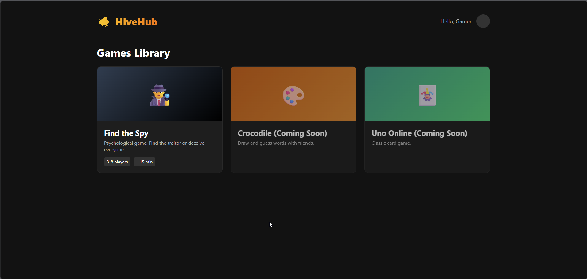
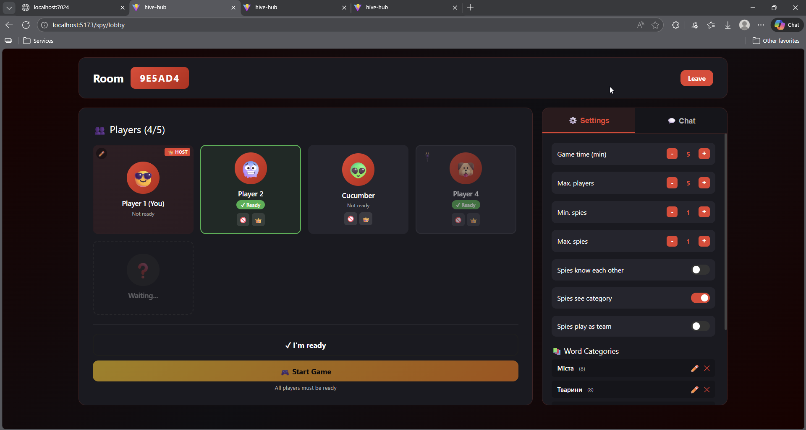
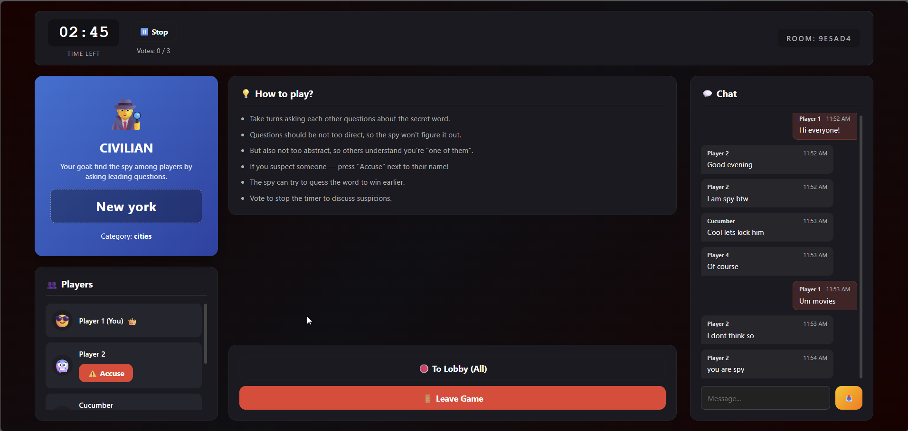
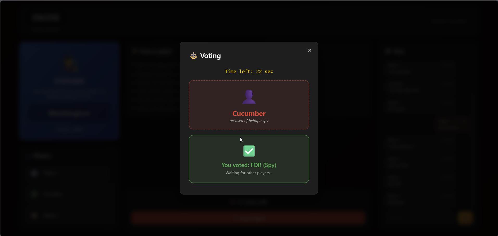
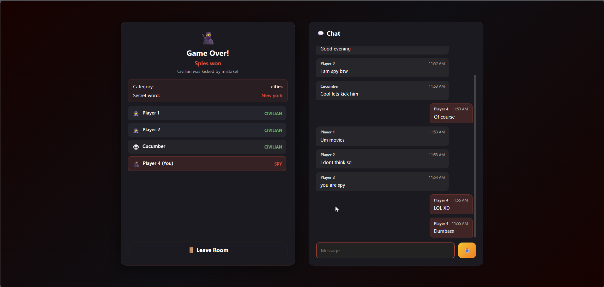

# 🐝 HiveHub

**HiveHub** is a real-time multiplayer web platform designed for playing browser-based social games with friends. Built with performance and low latency in mind using **ASP.NET Core** and **SignalR**, paired with a modern **React + TypeScript** frontend.

Currently, the platform features the game **"Find the Spy"**, with more games like *Crocodile* and *Uno Online* coming soon.

## 🚀 Technologies

* **Backend:** ASP.NET Core, SignalR (WebSockets)
* **Frontend:** React, TypeScript
* **Containerization:** Docker

## 🎮 Available Games

### 🕵️ Find the Spy

A psychological party game where players must find the spy among them while the spy tries to guess the secret location.

**Key Features:**

* **Room Management:** No registration! Create and join private rooms via code.
* **Lobby Control:** Hosts can kick players, transfer ownership, and fully customize game rules (timer settings, spy count, etc.).
* **Custom Content:** Create custom word packs and categories or upload them directly from a file.
* **Connection Monitoring:** Real-time visual indicators for players experiencing connection instability.
* **Chat Support:** Integrated real-time messaging allows players to discuss suspicions, coordinate votes, or bluff their way to victory.
* **Game Flow:** Automated timers for rounds, discussions, and voting phases.
* **Spy Mechanics:**
* **Word Guessing:** The spy can attempt to guess the location at any time to win immediately.
* **Soft Validation:** The guessing system is typo-tolerant (soft validation) to ensure fair play.
* **Last Chance:** If the group votes to eliminate the spy, the spy gets one final chance to guess the word and steal the victory.
* **Voting System:** Majority-based voting logic for accusations and elimination.

## 📸 Screenshots

| **Game Library** | **Lobby & Settings** |
|:---:|:---:|
|  |  |
| *Choose your game* | *Customize rules & categories* |

| **Gameplay** | **Voting Phase** |
|:---:|:---:|
|  |  |
| *Role assignment & chat* | *Accuse suspects* |

| **Game Over** |
|:---:|
|  |
| *Final results & roles revealed* |

## 🛠 Getting Started

The project is fully containerized for easy setup.

### Prerequisites

* [Docker](https://www.docker.com/) installed on your machine.

### Installation & Running

1. Clone the repository:
```bash
git clone https://github.com/Oleh-Bashtovyi/HiveHub
cd hivehub

```

2. Start the application using Docker Compose from the root directory:
```bash
docker compose up

```

3. Open your browser and navigate to:
```
http://localhost:8081/

```

## 🔮 Future Plans

* Add **Crocodile** (Draw & Guess) game mode.
* Add **Uno Online** card game.

## Project Status

The project is currently in the Active Development phase. We have successfully implemented the MVP with the core "Find the Spy" game engine, featuring stable real-time synchronization via SignalR and full Docker containerization.

## License

This project is licensed under the MIT License.
